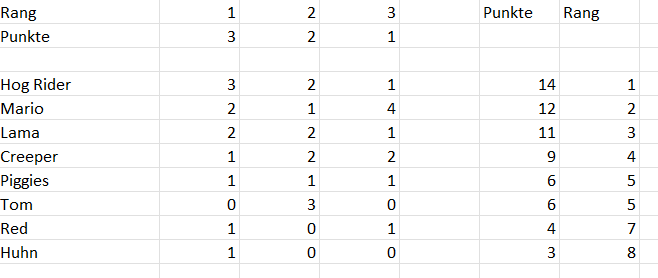
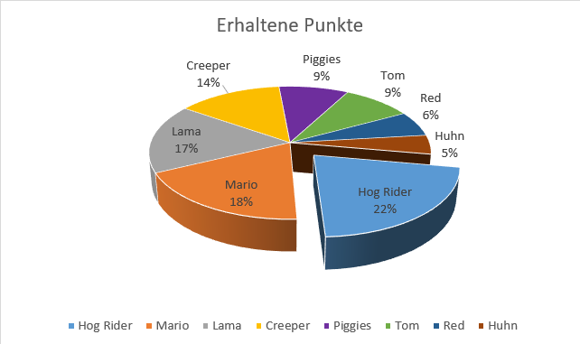
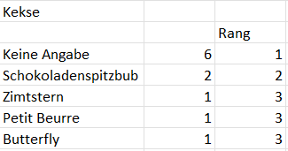
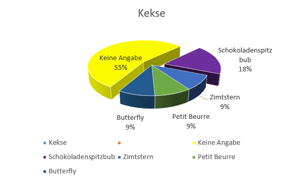

+++
title = "Datenerhebung"
date = "2022-11-01"
draft = false
pinned = false
description = "Nach der Kreierung unserer Umfrage war es an der Zeit, diese auch durchzuführen. Dies haben wir heute gemacht."
+++
Letzte Woche haben wir die Plüschtiere gesucht, die wir in unserer Umfrage zur Wahl stellen wollen. Nun war also die Zeit gekommen, diese Umfrage durchzuführen und die Daten auszuwerten.

**Datenerhebung**

Wir sind also im Schulhaus umhergegangen und haben die Schüler nach ihrer Meinung gefragt. Dass wir nicht eine Strassenumfrage gemacht haben, hat den einfachen Grund, dass wir keine fremdem Personen fragen wollten, da dies für uns unangenehm gewesen wäre. Ausserdem nehme ich an, dass die meisten Leute auf der Strasse kein Interesse daran gehabt hätten, unser Plüschtiersortiment zu bestimmen. Allerdings gab es auch einige Schüler, die sich nicht an unserem Projekt beteiligen wollten. Trotzdem konnten wir ausreichend viele Meinungen einholen.

**Datenanalyse**

Nach der Durchführung unserer Umfrage haben wir unsere Daten ausgewertet. Um dies veranschaulichen zu können, muss ich zuerst das Prinzip hinter der Umfrage erklären. Wir haben die Befragten gebeten, ihre Top 3 Plüschtiere zu wählen. Der erste Platz hat dann jeweils 3 Punkte bekommen, der zweite Platz noch 2 Punkte und der dritte Platz einen Punkt. Folgendes ist dabei also herausgekommen:

Der Hogrider ist also das beliebteste Plüschtier, welches wir zur Auswahl gestellt hatten. Die zweitbeliebteste Videospielfigur belegt mit Mario ein absolutes Urgestein der Videospielszene. Platz 3 hingegen kommt aus einem neueren Spiel und wird vom Lama belegt.

Der Hogrider hat mit 22% knapp einen Viertel der möglichen Punkte erreicht und die Umfrage somit dominiert. Aber auch Mario hat ganze 18% der Punkte bekommen und ist somit nur knapp vor dem Lama, welches 17% der Punkte erhielt.

Da wir bei jeder eingegangenen Bestellung im Wert von mehr als 20 Franken Kekse mitliefern, haben wir auch nach den Lieblingskekssorten gefragt. Leider hatte ein Grossteil der Befragten keine Lieblingssorte. Trotzdem hier die Rangliste:

Schokoladenspitzbuben haben mit 2 Stimmen die meisten Stimmen bekommen. Auch hierzu ein Diagramm:

In Zukunft werden wir also massenhaft Hogrider mit Schokoladenspitzbuben verkaufen. ;-)