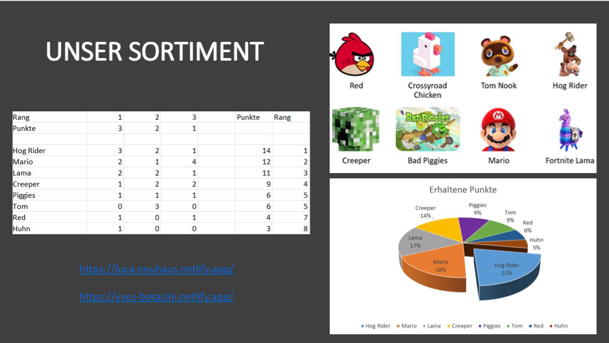
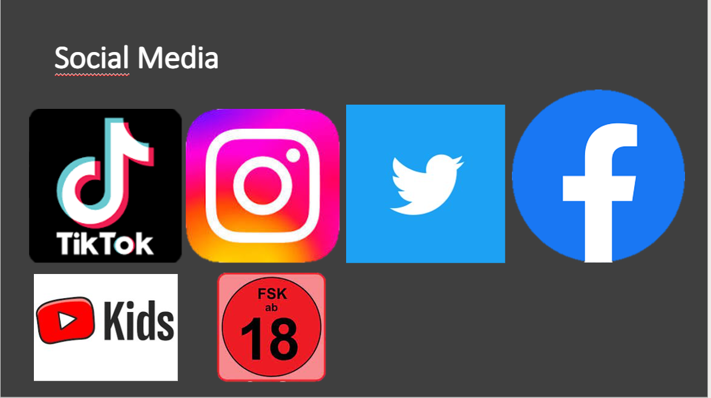

+++
title = "Marketingstrategie für unseren Plüschtierladen"
date = "2022-12-13"
draft = false
pinned = false
image = "https://external-content.duckduckgo.com/iu/?u=http%3A%2F%2Fwidegroup.net%2Fwp-content%2Fuploads%2F2015%2F01%2Fmarketing.jpg&f=1&nofb=1&ipt=1218bb0ce54048acb718d7484cef4e28a139bb06abc1d04785b3562792d06a0e&ipo=images"
description = "Den bestmöglichen Erfolg erreicht man mit der besten Marketingstrategie. Hier veröffentlichen wir unsere Strategie."
footnotes = "Quellen:\n\n<https://external-content.duckduckgo.com/iu/?u=http%3A%2F%2Fwidegroup.net%2Fwp-content%2Fuploads%2F2015%2F01%2Fmarketing.jpg&f=1&nofb=1&ipt=1218bb0ce54048acb718d7484cef4e28a139bb06abc1d04785b3562792d06a0e&ipo=images>"
+++
Damit die Werbestrategie erfolgreich sein kann, muss man sich zuerst bewusst werden, an wen diese Werbung gerichtet sein soll. Deshalb hier ein paar Fakten über unser Unternehmen und unsere Kundschaft. 

Wir sind ein Unternehmen, das Plüschtiere von Figuren aus bekannten Videospielen verkauft. Aus diesem Tätigkeitsbeschrieb lässt sich relativ einfach ablesen, wer zu unserer Zielgruppe gehört. Unser durchschnittlicher Kunde ist tendenziell ein Kind oder Jugendlich, da man in diesem Alter gerne mit Plüschtieren spielt. Ausserdem spielt diese Person gerne viele verschiedene Videospiele.

Nun stellt sich also die Frage, wie man diese Zielgruppe am besten erreichen kann. Dies geschieht am einfachsten über Social Media. Deswegen haben wir uns für verschiedene Kanäle davon entschieden. 

Zu unseren Werbeplattformen gehören TikTok, Instagram, Twitter, Facebook, YouTube Kids, aber auch einige Seiten ab 18 Jahren, da sich Jugendliche gerne auf solchen Seiten bewegen.

Wir versuchen also, gezielt eine gewisse Zielgruppe auszumachen und diese dann auf möglichst vielen verschiedenen Plattformen zu bewerben. Dabei ist uns wichtig, darauf zu achten, dass diese Werbeplattformen bei der Zielgruppe aktuell angesagt ist, damit die Werbung auch bei ihr ankommt. 

Doch gute Werbeplattformen sind nicht alles. Wie die Werbung aufgebaut ist, spielt auch eine Rolle. Wir haben uns dazu entschieden, eine bekannte Werbung einer dieser Figuren zu parodieren. Folgendes ist dabei herausgekommen:

Ihr könnt uns gerne auf allen oben genannten Plattformen folgen.